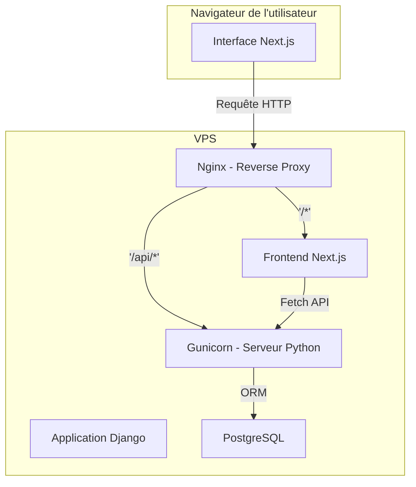

Plan Projet — Application Web Gestion Élèves (excel → Web)

# Objectif du Projet

Construire une application web sécurisée et performante pour centraliser, consulter et analyser les données scolaires des élèves sur plusieurs années, avec recherche full text sur le nom et filtrage par année, classe et section.

# Vue d'ensemble

* Centraliser toutes les données Excel dans une base de données unique.
* Permettre la recherche par nom (même partiel), année ou classe.
* Fournir un tableau de bord avec statistiques et graphiques.
* Filtrer dynamiquement les résultats selon différents critères.
* Interface web moderne et sécurisée.

# Stack Technique

* Backend: Django + Django REST Framework (ORM robuste, admin intégré, sécurité native).
* Frontend: Next.js (React) pour SSR/SSG et visualisation interactive.
* Base de données: PostgreSQL.
* API REST pour communication frontend-backend.
* Scripts d'import Excel via Pandas/openpyxl.

# Architecture



# Modèle de données

```python
from django.db import models

class SchoolYear(models.Model):
    year = models.CharField(max_length=9, unique=True)

class Classe(models.Model):
    name = models.CharField(max_length=100)

class Section(models.Model):
    name = models.CharField(max_length=100)

class Student(models.Model):
    full_name = models.CharField(max_length=255, db_index=True)

class Enrollment(models.Model):
    student = models.ForeignKey(Student, on_delete=models.CASCADE)
    school_year = models.ForeignKey(SchoolYear, on_delete=models.PROTECT)
    classe = models.ForeignKey(Classe, on_delete=models.PROTECT)
    section = models.ForeignKey(Section, on_delete=models.PROTECT)
    percentage = models.FloatField()

    class Meta:
        unique_together = ('student', 'school_year')
```

* Indexation full text sur `full_name` pour recherches partielles.
* Filtres dynamiques sur année, classe, section.

# Fonctionnalités

* Import Excel avec validation et détection de doublons.
* Liste des élèves avec barre de recherche full text et filtres.
* Profil détaillé de chaque élève avec historique complet et graphique d'évolution.
* Tableau de bord avec statistiques par classe/section/année.
* Boutons de filtrage interactifs et export de données.
* Authentification et permissions (administrateur).

# Structure des dossiers `uploads/` et `analytics/`

* **uploads/** : Contiendra tous les fichiers Excel téléversés par l’administrateur, classés éventuellement par date ou par lot pour permettre le suivi et le réimport.
* **analytics/** : Contiendra les scripts et fichiers générés pour les analyses avancées, par exemple des exports CSV ou JSON pour graphiques, rapports statistiques, ou dashboards. Peut également contenir les logs ou caches des calculs de performance pour le dashboard.

# Développement par phases

1. **Phase 0 : Préparation** – Git, env virtuel, installation Django, DRF, Next.js, PostgreSQL.
2. **Phase 1 : Backend** – Modèles, admin, script d'import Excel, API REST (CRUD, filtres, recherche full text).
3. **Phase 2 : Frontend** – Layout, pages élèves, dashboard, intégration API, graphiques, filtres interactifs.
4. **Phase 3 : Déploiement VPS** – Nginx, Gunicorn, Next.js, SSL, sécurisation, monitoring.

# Sécurité & Bonnes pratiques

* Variables d'environnement pour secrets.
* Accès API restreint à l'administrateur.
* Sauvegardes régulières PostgreSQL.
* CORS strict et sanitisation des entrées.
* Pagination et cache pour performance.

# Estimation

* Temps développement: 5-6 semaines.
* Complexité: Moyenne.
* Coût VPS: 10-20€/mois.

# Structure projet

```
student-management/
├── backend/
│   ├── apps/
│   │   ├── students/
│   │   ├── uploads/       # fichiers Excel téléversés
│   │   └── analytics/     # scripts et exports pour dashboards et analyses
│   ├── requirements.txt
│   └── manage.py
├── frontend/
│   ├── components/
│   ├── pages/
│   ├── hooks/
│   ├── utils/
│   └── package.json
├── docker-compose.yml
└── README.md
```

* Full text search sur `Student.full_name`
* Filtres dynamiques par année, classe et section
